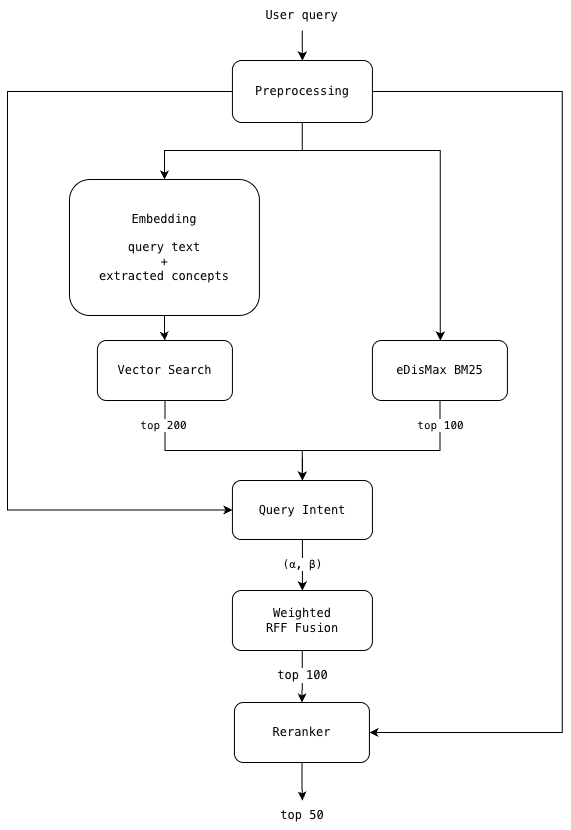

# SC4021 AI Opinion Search Engine

This repository contains a Reddit opinion search engine built around a hybrid retrieval stack:
fielded BM25 in Solr, dense vector retrieval over chunked documents, intent-aware weighted RRF
fusion, and a reranker before result presentation in a Flask UI.

The canonical application root is `src/`. The repository root keeps shared entrypoints such as
`docker-compose.yml` and this README.

## What The System Does

The codebase supports two connected workflows:

1. Index a Reddit dataset with NLP enrichment into a Solr core.
2. Serve an interactive search UI that combines lexical and semantic retrieval for opinion-focused
   search over posts and comments.

At indexing time, the ingestion pipeline cleans documents, derives retrieval fields, extracts model
and vendor mentions, generates chunk records for vector search, and writes Solr-ready JSONL output.
At query time, the application preprocesses the query, runs BM25 and vector retrieval in parallel,
weights the branches using inferred query intent, fuses them with weighted reciprocal rank fusion,
reranks the candidates, and renders the final results with filters and facets.

## Architecture



The retrieval path is organized into these stages:

- `Preprocessing`: normalize the query and derive enriched lexical and concept-aware forms.
- `eDisMax BM25`: query Solr over weighted textual fields for precise lexical recall.
- `Embedding + Vector Search`: embed the query text and extracted concepts, then search the dense
  vector index over chunk records.
- `Query Intent`: estimate intent weights that determine how strongly lexical and vector signals
  should influence fusion.
- `Weighted RRF Fusion`: combine the ranked candidate lists into a single blended ranking.
- `Reranker`: rescore the fused candidates and return the final top results to the Flask UI.

## Codebase Tour

### Application and retrieval

- `src/app.py`: Flask entrypoint, request handling, Solr readiness checks, and template rendering.
- `src/hybrid_search.py`: hybrid retrieval engine, vector search helpers, RRF fusion, reranking,
  analytics, and result shaping.
- `src/query_intent.py`: intent inference used to tune lexical vs vector weighting.
- `src/nlp_utils.py`: NLP preprocessing helpers for indexing and query enrichment.

### Indexing and Solr

- `src/scripts/prepare_solr_docs.py`: single-source ingestion pipeline for
  `src/final_reddit_dataset_with_predictions.csv`.
- `src/schema_add_fields.json`: Solr schema extensions required by the search stack.
- `src/solr/configs/`: core configuration mounted by Docker when creating the `reddit_ai` core.
- `src/data/`: generated indexing outputs such as `reddit_docs.jsonl` and converted JSON payloads.

### Evaluation and tests

- `src/scripts/benchmark_queries.py`: lightweight benchmark runner for Solr-only and full hybrid
  flows.
- `src/scripts/evaluate_hybrid_vs_bm25.py`: paired evaluation flow for comparing BM25 and hybrid
  retrieval through the Flask endpoint.
- `src/tests/`: regression tests covering retrieval logic, Flask behavior, and evaluation code.
- `src/reports/`: retained evaluation outputs and judgments for reference.

### Supporting material

- `src/templates/index.html`: Flask search UI template.
- `src/changelog/`: project change history and report-oriented notes retained for submission
  context.

## Repository Layout

```text
.
├── docker-compose.yml
├── README.md
├── docs/
│   └── images/
│       └── hybrid_retrieval_pipeline.png
└── src/
    ├── app.py
    ├── final_reddit_dataset_with_predictions.csv
    ├── hybrid_search.py
    ├── nlp_utils.py
    ├── query_intent.py
    ├── schema_add_fields.json
    ├── scripts/
    ├── solr/
    ├── templates/
    ├── tests/
    ├── reports/
    └── data/
```

## Setup And Run

### 1. Start Solr from the repo root

```bash
docker compose up -d
```

This creates the `reddit_ai` core and mounts `src/solr/configs/` into the container.

### 2. Apply the Solr schema additions

```bash
cd src
curl -X POST -H "Content-type:application/json" \
  http://localhost:8983/solr/reddit_ai/schema \
  --data-binary "@schema_add_fields.json"
```

### 3. Build Solr-ready documents

```bash
cd src
python scripts/prepare_solr_docs.py
```

This writes `src/data/reddit_docs.jsonl`. Convert it to a JSON array before posting to Solr:

```bash
cd src
python - <<'EOF'
import json

with open("data/reddit_docs.jsonl", encoding="utf-8") as fh:
    docs = [json.loads(line) for line in fh if line.strip()]

with open("data/reddit_docs.json", "w", encoding="utf-8") as fh:
    json.dump(docs, fh, ensure_ascii=False)
EOF
```

### 4. Index the generated JSON into Solr

```bash
cd src
curl -X POST \
  "http://localhost:8983/solr/reddit_ai/update?commit=true" \
  -H "Content-Type: application/json" \
  --data-binary "@data/reddit_docs.json"
```

### 5. Start the embedding and reranker services

The hybrid path expects two local `llama-server` processes:

- Embedding model: `jina-embeddings-v3-f16.gguf`
- Reranker model: `bge-reranker-v2-m3-FP16.gguf`
- embeddings: `http://localhost:8081/v1/embeddings`
- reranker: `http://localhost:8082/v1/rerank`

Model download pages:

- `jina-embeddings-v3-f16.gguf`:
  [gaianet/jina-embeddings-v3-GGUF](https://huggingface.co/gaianet/jina-embeddings-v3-GGUF/tree/main)
- `bge-reranker-v2-m3-FP16.gguf`:
  [gpustack/bge-reranker-v2-m3-GGUF](https://huggingface.co/gpustack/bge-reranker-v2-m3-GGUF/blob/main/bge-reranker-v2-m3-FP16.gguf)

Model roles:

- `jina-embeddings-v3-f16.gguf` converts the query text and extracted concepts into dense vectors
  for the vector-search branch.
- `bge-reranker-v2-m3-FP16.gguf` reranks fused BM25 + vector candidates before the final
  ranking is returned to the UI.

Example commands:

```bash
llama-server -m ~/Desktop/Models/jina-embeddings-v3-f16.gguf --embeddings --port 8081 -c 8192
llama-server -m ~/Desktop/Models/bge-reranker-v2-m3-FP16.gguf --rerank --port 8082 -c 8192
```

### 6. Run the Flask UI

```bash
cd src
pip install -r requirements.txt
python app.py
```

Open [http://localhost:5001](http://localhost:5001).

The app defaults to `http://localhost:8983/solr/reddit_ai/select`. Override `SOLR_URL` only if
you intentionally point to a different core with the same schema.

## Data And Generated Artifacts

- Required runtime/input CSV:
  `src/final_reddit_dataset_with_predictions.csv`
- Primary generated files:
  - `src/data/reddit_docs.jsonl`
  - `src/data/reddit_docs.json`
  - `src/data/reddit_docs_ascii.json`
- Solr schema/config inputs:
  - `src/schema_add_fields.json`
  - `src/solr/configs/managed-schema.xml`
  - `src/solr/configs/solrconfig.xml`

The application reads the predictions CSV for subreddit options and the indexing pipeline uses the
same file as its canonical source dataset.

## Search Features

- Hybrid retrieval across BM25 and dense vector search
- Query-intent-aware weighted fusion
- Reranked final results
- Filters for type, sentiment, dataset, model, vendor, subreddit, and date
- Solr schema checks at runtime so misconfigured cores fail with actionable messages

## Testing And Evaluation

Run the main test suite:

```bash
python3 -m pytest src/tests
```

Useful evaluation commands:

```bash
python3 src/scripts/benchmark_queries.py --help
python3 src/scripts/evaluate_hybrid_vs_bm25.py --help
```

Evaluation outputs are retained in `src/reports/` as reference material. They are not required for
the runtime search stack itself.

## Submission Notes

- The canonical application now lives entirely in `src/`.
- The repo root remains the operational entrypoint for Docker and top-level documentation.
- `README.md` is the primary source of truth for setup and architecture.
- Historical changelog and evaluation artifacts are preserved for project context, not because the
  runtime pipeline depends on them.

## Maintenance

Stop Solr:

```bash
docker compose down
```

Stop Solr and remove indexed data:

```bash
docker compose down -v
```
